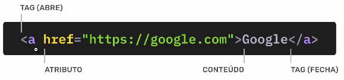

# HyperText Markup Language (HTML)

- Linguagem de marcação de texto.
- Marca o conteúdo e define a estrutura do site.

## Tag

- São etiquetas. Servem para marcar um conteúdo dentro do HTML.
- Servem para inserirmos conteúdos como textos, imagens e vídeos, por exemplo.
- Dão sentido ao conteúdo. A escrita de um documento semântico beneficia principalmente leitores de tela (acessibilidade) e leitores de código.
- Abrimos `<a>` e fechamos `</a>`
- Case insensitive, mas é uma boa prática escrever com letras minúsculas; exemplo: `<html>`.
- Permite a interação com `CSS` e `JavaScript`.

## Atributos

- Dão informações extras sobre uma taf para o browser.
- Eles ajudam o navegador a entender melhor como renderizar o elemento ou como ele deve se comportar.

**Estrutura de uma `Tag` `HTML`:**



## Tags comuns

- `p` -> Marca um parágrafo.
- `h1`, `h2`, `h3`, `h4`, `h5`, `h6` -> Marcam diferentes níveis de títulos.
- `a` -> Marca um link.

### img

- Adiciona imagens à nossa página.
- `src` -> atributo que define o caminho da imagem.
- `alt` -> Texto alternativo que será lido por leitrores de tela (tarz acessibilidade).
- `max-width: 100%` -> Geralmente definimos um width máximo de 100% para a imagem, assim ela não cresce além do elemento pai.

```html

```

## 1. Achar Fotos

- [Unsplash](https://unsplash.com/pt-br): Excelente repositório de imagens gratuitas e de alta qualidade.

## 2. Otimizar Fotos

- [Squoosh](https://squoosh.app/): Ferramenta para compressão e otimização de imagens.
